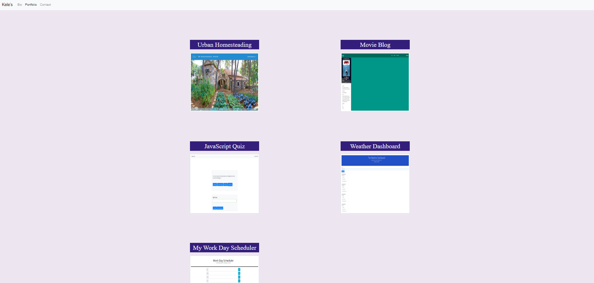

# Kele's Portfolio

### About:

This is my current portfolio which includes a personal biography, information about my current works, and contact information. The bio page provides a visitor with the chance to get to know me better. Here, answers for common questions and a brief personal narative are provided.

### Features:

- Mobile-first design

- Bootstrap aesthetics

- A brief autobiography

- Links to my GitHub profile & LinkedIn page

- Contact page with my email address

- Link to my resume

- A list of my current projects, including the following information:

  1. Project titles and descriptions

  2. Links to project GitHub repositories 

  3. Links to deployed applications

### Built With:

- HTML - Standard markup language

- CSS - Style sheet language

- Bootstrap - CSS framework

### Visit <a href="https://foxk2p.github.io/Portfolio-KeleP/" target="_blank">My Portfolio</a>

